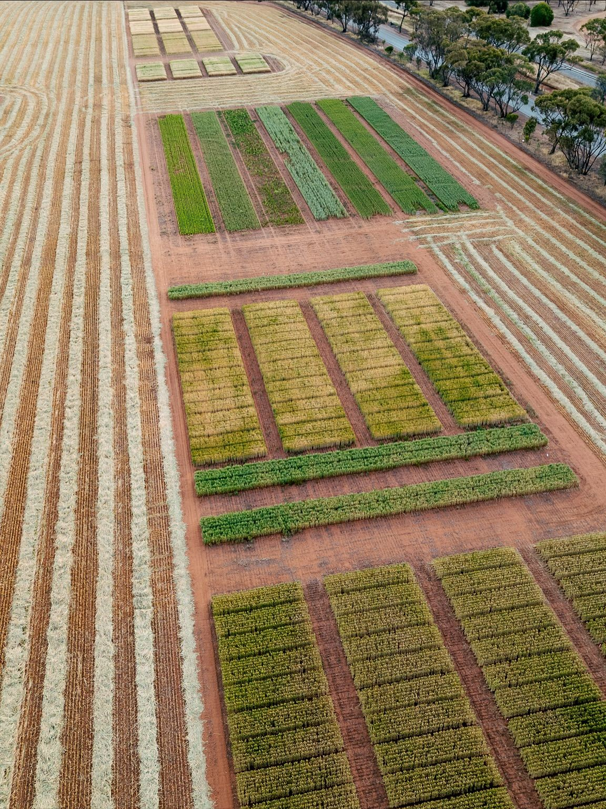

::: hero
# 
:::

# **Quem Somos**

:::: container

A FPF AgroScience é uma empresa voltada à inovação no agronegócio, construída sobre valores sólidos como qualidade, confiabilidade, compromisso e excelência técnica. Ao longo de sua trajetória, tem se destacado pela atuação consistente na geração de conhecimento e no desenvolvimento de soluções aplicadas à agricultura.

Com foco em pesquisa e experimentação agrícola, a FPF AgroScience desenvolve estudos que abrangem defensivos químicos e biológicos, fertilizantes, sementes e novas tecnologias voltadas ao campo. Seu trabalho contribui diretamente para a validação de produtos e para a tomada de decisão no setor agrícola, sempre com base em dados confiáveis e rigor científico.

A empresa atua em conformidade com normas e exigências regulatórias, garantindo a qualidade, rastreabilidade e segurança dos ensaios conduzidos. Seu compromisso com a excelência técnica assegura resultados precisos e relevantes para parceiros e clientes.

Mais do que prestar serviços, a FPF AgroScience busca construir relações de confiança, oferecendo soluções eficientes, com responsabilidade ética, confidencialidade e foco no desenvolvimento sustentável do agronegócio.

::::